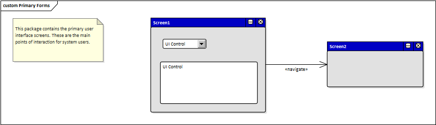
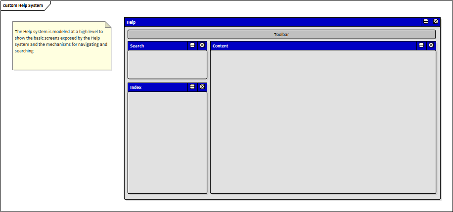

# Documento de Visão do Projeto "Quick Issue"

Este documento apresenta uma solução de software para o projeto *Quick Issue*, solicitado pelo cliente *Universidade Presbiteriana Mackenzie*, apresentando os problemas a serem solucionados, as necessidades dos principais envolvidos, o alcance do projeto e as funcionalidades esperadas do sistema.

## Objetivos

O objetivo deste software é solucionar problemas da universidade através de uma plataforma na qual os funcionarios e alunos poderão contribuir voluntariamente postando os problemas encontrados pela universidade. Com isso, o administrador da ferramenta poderá fazer uma análise da ocorrência reportada e solucionar de forma mais rápida, aumentando a satisfação dos seus funcionários e alunos.

## Problema

* Descrição do problema: falha no acompanhamento de manuntenção interna da universidade.
* Quem é afetado pelo problema: a própria instituição e os funcionários e alunos da universidade.
* Impacto no negócio: zelar pelo patrimônio da universidade e manter a satisfação dos funcionários e alunos.  
* Benefícios de uma boa solução: os problemas da universidade serão geridos de uma forma mais rápida e prática, contribuindo para os funcionários e alunos.

## Definições, abreviações e outros termos do domínio do problema

* Definição 1
* Definição 2
* Definição 3
* etc.

## Integração com outros sistemas

* Sistema externo 1
* Sistema externo 2
* Sistema externo 3
* etc.
 
## Interessados

* Fornecedor
* Universidade
* Funcionários
* Alunos

## Usuários

* Público interno da universidade

## Funcionalidades do produto

* Funcionalidade 1
* Funcionalidade 2
* etc.

## Restrições do projeto

* Restrição 1
* Restrição 2
* Restrição 3
* etc.

## Protótipos de tela

### Protótipos para funcionalidade 1

Fonte: Exemplos gerados pelo assistente do **Enterprise Architect**.

### Protótipos para funcionalidade 2

Fonte: Exemplos gerados pelo assistente do **Enterprise Architect**.

### Protótipos para funcionalidade N
